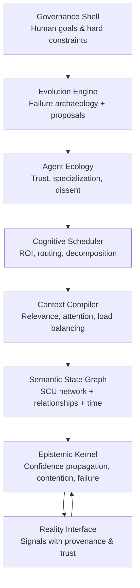
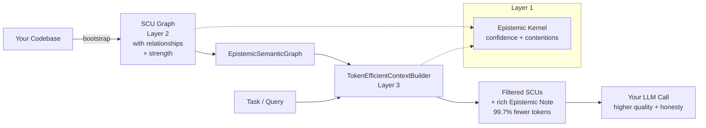

# Noesis

**An AI-Native Cognitive Runtime for Honest Reasoning Under Uncertainty**

[](https://www.python.org/)
[](https://opensource.org/licenses/MIT)
[](https://github.com/xbox002000/Noesis)
[](https://github.com/xbox002000/Noesis/stargazers)

Noesis is an experimental runtime designed from the ground up for AI systems that must reason under uncertainty, manage finite cognitive resources (tokens, attention), and remain **epistemically honest** about what they know, what they don't know, and where they might be wrong.

> "Uncertainty is not a bug — it is the fundamental input to every inference step."

**⭐ This project is early-stage research (currently 1 star) but delivers concrete, measurable improvements in token efficiency and epistemic honesty for LLM agents.** 

**v0.1.0-alpha is now available on GitHub Releases!** If you believe in building more reliable AI systems, please consider starring the repo — it helps visibility for open-source programs (e.g. OpenAI Codex) and future contributors. Every star counts at this stage.

---

## The Problem with Today's Agent Frameworks

Most agent frameworks treat AI like this:

```
input → AI (magic) → output
```

This model is fundamentally broken for real cognitive work.

Real reasoning looks like:

```
partial_context + uncertainty + goals
  → reasoning under hard constraints
  → confidence-weighted action
  → feedback that updates the reasoner itself
```

Current systems hide uncertainty, over-confidently hallucinate, waste enormous numbers of tokens on irrelevant context, and have no principled way to detect when their own reasoning has failed.

Noesis exists to explore what a runtime built on **AI-native systems principles** would look like.

---

## Standout Results

Noesis already delivers dramatic, measurable improvements today:

### Token Efficiency (Layer 2 + Layer 3)
On this very codebase (~40k tokens of source):

| Task | Naive (full codebase) | Noesis Context | Savings |
|------|-----------------------|----------------|---------|
| Understand Epistemic Kernel | 40,246 | 163 | **99.6%** |
| Understand Bootstrap process | 40,246 | 141 | **99.6%** |
| Token efficiency & Context Compiler | 40,246 | 175 | **99.6%** |
| Find conflict & relationship code | 40,246 | 70 | **99.8%** |

**Average reduction: 99.7%** while delivering higher-quality, epistemically annotated context.

### Epistemic Honesty (Medium mode)
We iterated the `epistemic_honesty_level="medium"` path in the Context Builder and achieved:

| Version              | Total Score (0-10) | Epistemic Honesty (0-2) | Notes |
|----------------------|--------------------|--------------------------|-------|
| **Smart (full)**     | 9.00               | 2.00                     | Best quality, highest cost |
| **Medium v7**        | **8.20**           | **1.90**                 | **91% of Smart quality** at far lower cost |
| Medium v2            | 7.50               | 1.75                     | Basic note |
| High-Confidence only | 5.50               | 0.50                     | Almost no honesty signaling |
| Naive (all SCUs)     | 4.50               | 0.50                     | High noise |

The Medium mode is now a **highly practical default** for production agents when you want most of the honesty benefits without Smart-mode cost.

---

## Core Concepts

Noesis is organized in principled layers (see the [full 8-layer blueprint](AI_NATIVE_RUNTIME_BLUEPRINT.md)):

- **Epistemic Kernel (Layer 1)**: First-class uncertainty types, confidence propagation (min along path + corroboration), contention detection, and semantic failure pattern recognition.
- **Semantic Graph (Layer 2)**: Knowledge lives as **Semantic Cognitive Units (SCUs)** — meaningful concepts with domains, risk, dynamics, and explicit relationships — not raw text chunks or files. Recently enhanced with **structured relationships** including `strength`, `confidence`, and `source` (Phase 1.4).
- **Context Compiler (Layer 3)**: The heart of practical value today. Assembles minimal, high-signal context with pluggable `epistemic_honesty_level` (`low` / `medium` / `high`). Produces rich **Epistemic Notes** explaining what was excluded and why, plus "Potential Impact" of the exclusions.

Higher layers (Cognitive Scheduler, Agent Ecology, Evolution Engine, Governance) are specified in the blueprint and partially prototyped.

---

## Key Features (Current)

- **Heuristic + feature-based SCU bootstrapping** from real Python codebases with zero or minimal dependencies.
- **Automatic cross-SCU relationship inference** (`depends_on`, `enables`) with quantitative strength based on call frequency.
- **`TokenEfficientContextBuilder`** — drop-in tool for agents:
  - Relevance + epistemic + risk-weighted scoring
  - Graph propagation (pull in indirectly related high-value SCUs)
  - Explicit exclusion tracking + rich Epistemic Notes (especially powerful in `medium` mode)
  - Borderline SCUs + task-specific "Potential Impact" analysis
- Experimental A/B testing harness (`llm_quality_ab_test.py`) with human-style rubric scoring.
- Clean separation of concerns and high-level `EpistemicSemanticGraph` facade for easy integration.

---

## Quick Start (Practical for Teams & Large Codebases)

### 1. Install & Use the CLI (Recommended for Real Work)

**v0.1.0-alpha released!** [GitHub Releases](https://github.com/xbox002000/Noesis/releases/tag/v0.1.0-alpha)

```bash
git clone https://github.com/xbox002000/Noesis.git
cd Noesis
pip install -e .

# One of the most practical commands for large organizations:
python -m noesis build-context \
  --codebase . \
  --task "Review recent authentication and payment changes for security and compliance issues" \
  --max-tokens 1800 \
  --honesty medium
```

Or via python module (reliable everywhere):

```bash
python -m noesis build-context --codebase /path/to/your/monorepo --task "..." --max-tokens 2000
```

We ship `requirements.txt` (explains the intentional zero core dependencies + how to opt-in to clustering/LLM features) and `requirements-dev.txt`. **No requirements.txt install step is needed for core + CLI usage.**

The `build-context` command bootstraps SCUs with cleaned relationships (Phase 1.5) and returns a compact, epistemically honest context ready for your LLM.

Other useful commands:

```bash
python -m noesis stats --codebase .                    # Relationship quality & graph health
python -m noesis bootstrap --codebase . --output graph.json   # Bootstrap once, reuse
```

### 2. Use from Python (Drop-in for Your Agents)

```python
from noesis import bootstrap_from_codebase, EpistemicSemanticGraph, TokenEfficientContextBuilder

# Bootstrap your (large) codebase — run once or on changes
scus = bootstrap_from_codebase("/path/to/your/production/codebase")

engine = EpistemicSemanticGraph()
engine.ingest_scus(scus)

# For every agent/LLM call:
builder = TokenEfficientContextBuilder(graph=engine)
result = builder.build_context_for_task(
    "Implement the new fraud detection rule and update the relevant docs",
    max_tokens=2200,
    epistemic_honesty_level="medium",  # excellent balance for production
)

print("Context tokens:", result.estimated_tokens)
print("Epistemic Note preview:\n", result.context[:800] if result.context else "")
```

This pattern gives you **dramatic cost savings + explicit honesty signals** that large organizations need for auditability and risk reduction.

### 3. Optional: Advanced Clustering + LLM Features

```bash
pip install noesis[clustering,llm]   # for features mode + real OpenAI calls in evals
```

See `experiments/llm_quality_ab_test.py` for using real models (great once you have OpenAI credits).

**Core has zero required dependencies.** Everything practical works out of the box.

---

## Architecture Vision (8 Layers)

Noesis follows a complete layered architecture (detailed in [AI_NATIVE_RUNTIME_BLUEPRINT.md](AI_NATIVE_RUNTIME_BLUEPRINT.md)).

### High-Level Layers



**Uncertainty propagates explicitly at every layer and never disappears.**

### Practical Core (What you use today - Layers 1-3)

For immediate adoption in agents and copilots, focus here:



This is the drop-in piece that delivers the dramatic cost savings and explicit "what we don't know" signals that enterprises need for production agents.

See [Quick Start](#quick-start-practical-for-teams--large-codebases) for the CLI and Python usage.

Core principles:
- Uncertainty is first-class
- Cognition has cost
- Trust must be earned
- Failure is semantic
- Humans govern; the system executes

---

## Current Status & Roadmap

**Active research prototype** — real working components you can use today, with a long-term vision.

**Recently completed (Phase 1.4)**: Full structured relationship model in the Semantic Graph (`strength`, `confidence`, `source` metadata) + frequency-based inference + rich helpers + stats tooling + full backward compatibility.

See:
- [Phase 1 SCU Relationship Enhancement Tasks](docs/phase1-scu-relationship-enhancement-tasks.md)
- [Complete Architecture Blueprint](AI_NATIVE_RUNTIME_BLUEPRINT.md) (Minimum Viable Implementation Roadmap with 5 phases)

Near-term focus areas include stronger call-graph + import resolution for relationships, module/class-level edges, normalization/cleanup passes, and connecting the stack to real LLM calls for human preference studies.

---

## Why This Matters (Especially for Reliable AI)

- **Epistemic honesty** directly attacks over-confident hallucinations.
- **Extreme token efficiency** makes sophisticated context management practical even on long codebases or large knowledge bases.
- **Principled foundations** (instead of more prompt engineering) give us levers that scale and can be audited.
- The project is small, focused, and aggressively documented — ideal for researchers and builders who want to experiment with next-generation agent architectures.

If you're building agents that must be trustworthy, cost-efficient, or introspective about their own knowledge limits, Noesis ideas and components are ready to borrow or extend.

---

## Documentation & Research Reports

- [AI Native Runtime Blueprint (full vision)](AI_NATIVE_RUNTIME_BLUEPRINT.md)
- [Medium Epistemic Honesty Improvement Report](experiments/reports/Medium_Epistemic_Honesty_Improvement_Report.md) — detailed iteration log + scores
- [Layer 2 Bootstrap → Layer 3 End-to-End Experiments](experiments/reports/) (heuristic & features modes, 99.7% savings data)
- [Phase 1 Development Tasks](docs/phase1-scu-relationship-enhancement-tasks.md)

---

## Contributing

We welcome contributions that improve epistemic honesty, relationship quality, evaluation rigor, or practical usability of the Context Builder.

Please read [CONTRIBUTING.md](CONTRIBUTING.md) (especially the philosophy section — intellectual honesty is non-negotiable here).

High-value areas right now:
- Stronger cross-file / import-aware call resolution in bootstrap (Phase 1.1)
- Relationship normalization & cleanup (Phase 1.5)
- Module-level and inheritance relationships (1.2 / 1.3)
- More tasks + human eval in the A/B framework

---

## License

MIT License

---

*Noesis is an exploration into building systems that can honestly reason about what they know, what they don't know, and what they might be wrong about.*

**If you're applying similar ideas or want to collaborate on reliable agent infrastructure, open an issue or reach out.** We believe this direction is important.